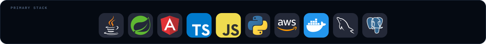
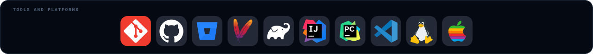
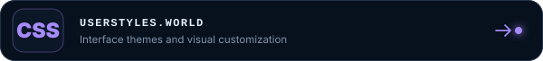

  

<!-- SIGNED-IN AND SIGNED-OUT SAFE NAVIGATION -->

  
  

 

  
  

 
 

<!-- PROFESSIONAL POSITION -->

  

   

  
    This profile features personal projects and open-source software developed independently of my professional work.
  

 

  

 

<h2 align="center">Featured systems</h2>

  
    Projects designed to reduce the distance between an engineering problem and a reliable solution.
  

 

<!-- FEATURED PROJECTS: ROW 1 -->

  
  

 

<!-- FEATURED PROJECTS: ROW 2 -->

  
  

 

  
<strong>Explore more projects</strong>

   

  

    
    
  

   

 

  

 

<h2 align="center">Engineering surface area</h2>

  

 

<h2 align="center">Technology constellation</h2>

  

  

  
  

 
 

<h2 align="center">GitHub signal</h2>

<!-- GITHUB STATISTICS -->

  
  

 

<!-- CONTRIBUTION ACTIVITY -->

  

 

<h2 align="center">Contribution trail</h2>

  

 

<!-- OPEN-SOURCE CHANNELS -->

  

<h2 align="center">Open-source channels</h2>

  
  

 
 

  

 

<!-- CONNECT AND SUPPORT -->

  
  

 
 

  

