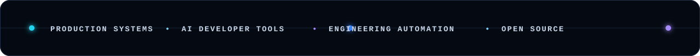

  

  
  
  
  

  
  
     The work featured on this profile represents personal and open-source projects built outside my professional role.
  

    
  

  

## Featured systems

  My projects focus on a consistent problem: reducing the distance between an engineering problem and a reliable solution.

  
  

  
  

  
<strong>Explore more projects</strong>

   

  

    
    
  

  

 

## Engineering surface area

  

 

## Technology constellation

  

  

  
  

 

## GitHub signal

  
  

  

 

## Contribution trail

  

 
 

<!-- OPEN-SOURCE CHANNELS -->

  

<h3 align="center">Open-Source Channels</h3>

  
  &nbsp;&nbsp;
  
  &nbsp;&nbsp;
  

 

<!-- CONNECT + SUPPORT -->

  
  &nbsp;&nbsp;&nbsp;
  

  

